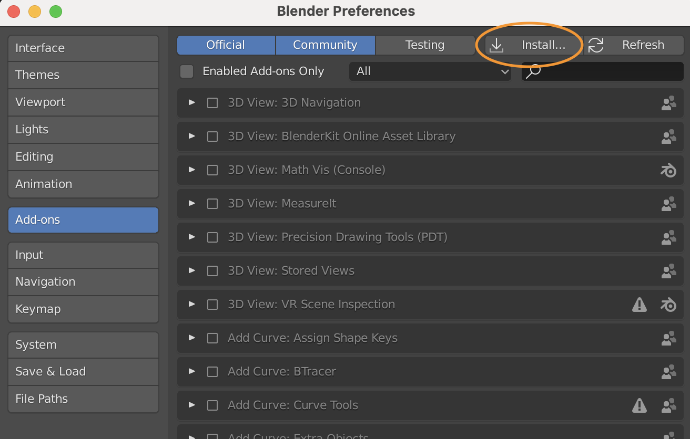
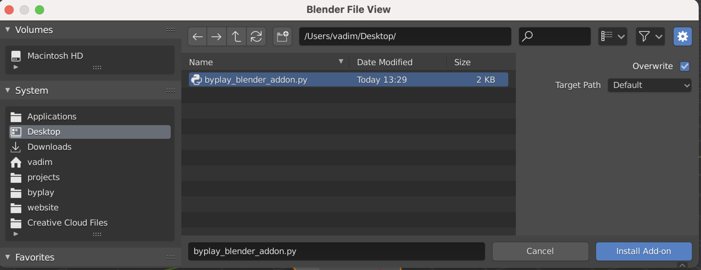
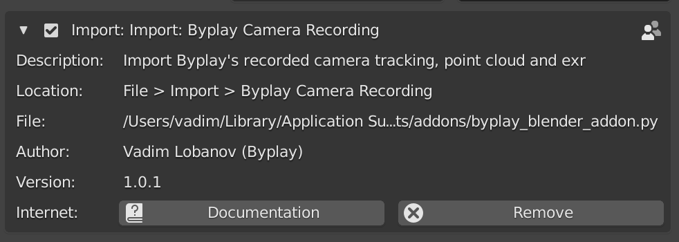

Blender plugin manual installation
======================================
When automatic installation from Byplay Desktop fails, you can always install the Blender addon manually.

Byplay Desktop will open a directory containing two files (or you can click on "Install manually"):
**byplay_blender_addon.py** and **README.txt**

1. Copy byplay_blender_addon.py to Desktop or any other folder that is easy to find
2. Open Blender
3. Go to Edit > Preferences > Add-ons > Install...

4. Select **byplay_blender_addon.py**
5. Click "Install Add-on..."

6. Enable the add-on by ticking the checkbox:

Done!
